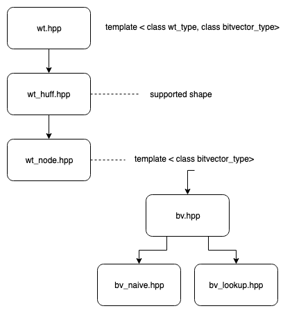

# Succinct Data Structure

Written by Yueh-Ting Chen (eopXD)

## Comparison to SDSL

[Succinct Data Structure Library 2.0](https://github.com/simongog/sdsl-lite)

I am taking version 2.1.1 for testing (`sdsl/`)

## Source Code

- `include/wt/`: underlying structures of wavelet tree
	- `wt_huff.hpp`: huffman shape construction
	- `wt_node.hpp`: tree ndoe structure
- `include/bv/`: structures of bit vector
	- `bv_naive.hpp`: naive implementation of rank and select
	- `bv_lookup.hpp`: rrr bitvector supporting rank (2 level blocking)

- `include/wt.hpp`: main wavelet tree structure, and rank/select/access operations
- `include/bv.hpp`: include bitvector implementations inside `bv/`
- `include/util.hpp`:  utility functions

### Constructors

Like all C++ STL, it is important to understand the constructors to be able to use the data structures.

## Papers

### Wavelet Tree

- Engineering Rank and Select Queries on Wavelet Trees
- Wavelet Tree for All

### Bit Vector

- RRR - A Succinct Rank_Select Index for Bit Vectors
- Succinct Indexable Dictionaries with Applications to Encoding k-ary Trees and Multisets
- Broadword Implementation of Rank Select Queries
- Fast, Small, Simple Rank/Select on Bitmaps

## Conventions

- source code should not exceed the 80th column
- `if/else/for/(do)while` shall have appropriate bracket, avoid ambiguity
- appropriate type definition inside structures
