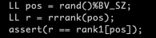

sdsl version 2.1.1

# bit vector

I am comparing my rrr bit vector (support rank) with the ones of sdsl library. The results are shown in `*.result`. Comparing the 2 implementations, with the same blocksize both rrr vectors show similar result.

sdsl supports bigger block size, which is a tradeoff between time and space. it shows that with bigger blocksize the time of access/rank also increases linearly (while the initialization time is x2 faster)

## inital compression (seconds)

| self-implemented RRR | sdsl RRR<15> | sdsl RRR<63> |
|----------------------|--------------|--------------|
| 21.481               | 37.587       | 11.9815      |

## assertion

assertions are added to confirm the correctness of functionality of the bit vector.

### self implemented

### sdsl

## access operation  (seconds)

| # of access | self RRR<15>                    | sdsl RRR<15>             | sdsl RRR<63>             |
|-------------|---------------------------------|--------------------------|--------------------------|
| 100000000   | 26.5677  (2.65677e-7)           | 26.3428 (2.63428e-7)     | 53.8254   (5.38254e-7)   |
| 200000000   | 40.9602  (2.04801e-7)           | 51.7332 (2.58666e-7)     | 104.854   (5.2427e-7)    |
| 400000000   | 78.5998  (1.964995e-7)          | 105.318 (2.63295e-7)     | 219.478   (5.48695e-7)   |
| 800000000   | 159.596  (1.99495e-7)           | 215.323 (2.69154e-7)     | 440.612   (5.50765e-7)   |

## rank operation (seconds)

| # of rank   | self RRR<15>                    | sdsl RRR<15>             | sdsl RRR<63>             |
|-------------|---------------------------------|--------------------------|--------------------------|
| 100000000   | 51.2577 (5.12577e-7)            | 37.7385 (3.77385e-7)     | 67.9364 (6.79364e-7)     |
| 200000000   | 77.1612 (3.85806e-7)            | 75.1629 (3.758145e-7)    | 151.004 (7.5502e-7)      |
| 400000000   | 154.828 (3.8707e-7)             | 162.457 (4.061425e-7)    | 262.063 (6.551575e-7)    |
| 800000000   | 315.236 (3.94045e-7)            | 306.403 (3.8300375e-7)   | 535.298 (6.691225e-7)    |

