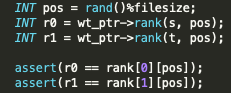
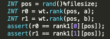
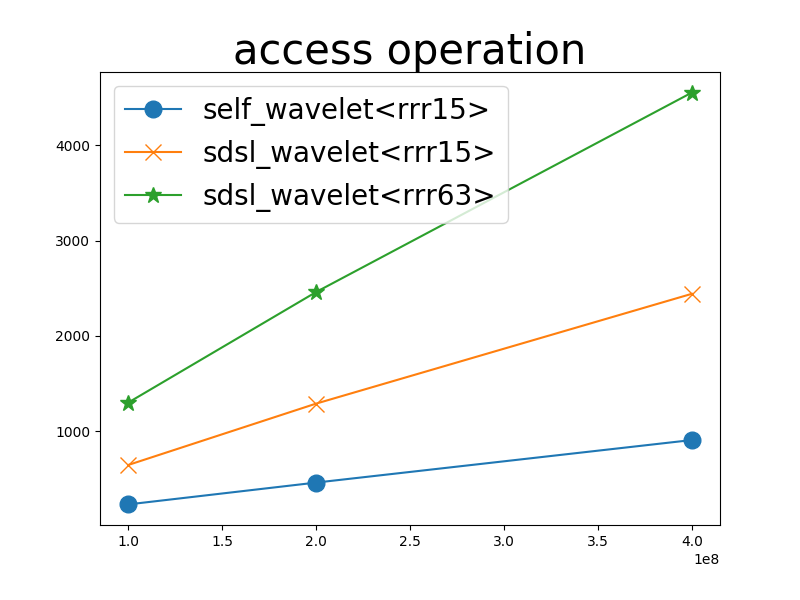
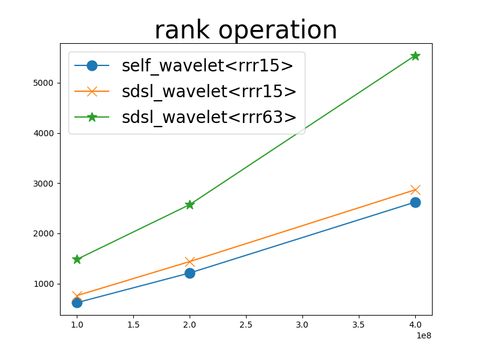

sdsl version 2.1.1

# wavelet tree

I am comparing my implemented wavelet_tree<rrr15> with sdsl library wt<rrr15> and wt<rrr63>.

## testing file

With random seed `112358` I generated a file of `2e9` bytes (\~1.8G). Each bytes is a random character. For this we will have all 256 characters as our alphabet set. Also since we generetes the file randomly, then the wavelet tree (though Huffman-shaped) will be a complete balance tree, which has 256 leaf nodes and is in a height of 8. With each character be represented by 8 bits, the wavelet tree will give no compression to the randomly genreated data. What we are comparing here is mainly the speed difference on access/rank operations of my implementation and sdsl library.

## Overheads to eliminate

- For each block, query `std::map` of alphabets to get the corresponding Huffman code of the alphabet
- Child nodes are saved in 2 different variabes rather than an array of size 2 saving pointers (conditional branch)
- Using `std::string` to determine the what alphabet is the input block, `std::string` is slow

## initialization

For a 1.8G file, loaded with stream mode.

| self-implemented RRR        | sdsl RRR<15>     | sdsl RRR<63>        |
|-----------------------------|------------------|---------------------|
| 991.567 (x2.15)             | 460.736 (x1)     | 491.933 (x1.07)     |

#### batch mode

Simply batch mode, but since we are manipulating big data this will be a less-used feature.

#### stream mode

In stream mode i go through the file twice. The 1st time to determine the frequncies of the alphabets of the data, used to determine the shape of the tree. The 2nd time goes through the string again to fill in the bits of the wavelet tree.

## assertion

I calculated the rank 2 random characters of the file for assertion. Access operation is seperately confirmed in another file, functionalities are ensured.





## access operation

| # of access | self wavelet<rrr15>          | sdsl wavelet<rrr15>             | sdsl wavelet<rrr63>             |
|-------------|------------------------------|---------------------------------|---------------------------------|
| 100000000   | 231.64  (2.314e-6)           | 645.174 (6.451e-6)              | 1299.59 (1.299e-5)              |
| 200000000   | 460.637 (2.303e-6)           | 1289.13 (6.445e-6)              | 2459.83 (1.229e-5)              |
| 400000000   | 906.981 (2.267e-6)           | 2441.27 (6.103e-6)              | 4552.66 (1.138e-5)              |



## rank operation

| # of rank   | self wavelet<rrr15>             | sdsl wavelet<rrr15>          | sdsl wavelet<rrr63>          |
|-------------|---------------------------------|------------------------------|------------------------------|
| 100000000   | 620.191 (6.202e-6)              | 760.376 (7.604e-6)           | 1482.68 (1.482e-5)           |
| 200000000   | 1210.8  (6.504e-6)              | 1438.38 (7.191e-6)           | 2572.20 (1.286e-5)           |
| 400000000   | 2622.41 (6.556e-6)              | 2867.85 (7.169e-6)           | 5542.69 (1.386e-5)           |



## ❗️ Time Leak ❗️

To reach the full extent of becoming a succinct data structure, it is a necessity to have performance measured as we expected, which we can calculate our expected performance by the observation on the underlying bitvector structure. For the tree we are testing with the random generated file, the tree shall grow into a complete biniary tree with height of 8. 

### Psuedo code of access operation of Wavelet Tree

```
CHAR* access ( NODE node, INT pos) {
	if node is a leaf:
		return (character of the leaf)
	bit = node->bitvec->access(pos)
	next_pos =  node->bitvec->rank(pos, bit)
	if bit == 0 :
		return (access(node->left_child, next_pos))
	if bit == 1 :
		return (access(node->right_child, next_pos))
}
```

So for every access operation of the wavelet tree, there should be 8 bitvector access operation and 8 bitvector rank operation used.

### Psuedo code of rank operation of Wavelet Tree

```
INT rank ( NODE node, INT pos, CHAR c, INT height ) {
	if node is leaf:
		return (pos)
	bit = huffman_code[c][height]
	next_pos = node->bitvec->rank(pos, bit)
	if bit == 0 :
		return (rank(node->left_child, next_pos, c, height+1))
	if bit == 1 :
		return (rank(node->right_child, next_pos, c, height+1))
}	
```

Rank operation on the Wavelet Tree shall go through 8 bitvector rank operations. This means that it shall be faster than the access operation of the wavelet tree. 

### Comparison

| operation | bit_vector<rrr15> | wavelet<rrr15>    |
|-----------|-------------------|-------------------| 
| access    | 2.65677e-7        | 2.314e-6          |
| rank      | 5.12577e-7        | 6.202e-6          |

- The rank operation is 12 times of the rank operation. This is far slower that the theoretical expectation of 8 times.
- rank shall perform faster than access, this is yet to be profiled

### access goes faster than rank

So it is actually unnatural that the access op. shows better performance than the rank op. , by investigating into my code, my intepretation of the delay is provided by `std::string` opertions to get the Huffman code of the character and is yet to be fixed.

## Conclusion

There are a few adjustments that I need to apply onto my code to make it meet the theoretical expectation. Performance shall be remeasured after the code is refined.

- eliminate all use of `std::string`
- avoid conditional branch as much as possible
- avoid `std::string` means `std::map` shall also be replaced my own `char` implementations of some querying and searching