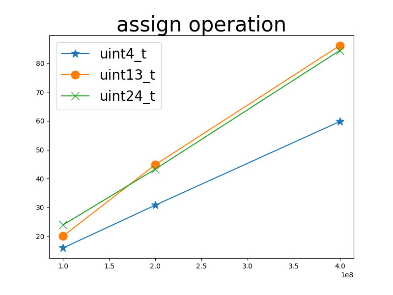
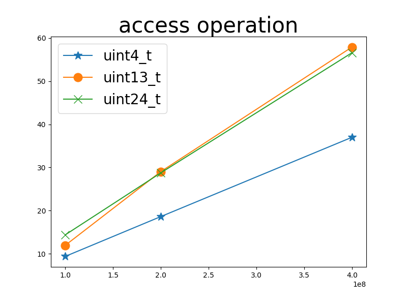

# misalign length unsigned integer library

For better compression rate of the RRR bit vector, I have implemented library of integers of misaligned-lengths.

## testing 

I have the `struct misalign` be a template container that allows different lengths be inserted. I experimented 3 kinds of lengths. Performance is as following...

## assign operation

| # of operation | bit length | speed   | ratio  |
|----------------|------------|---------|--------|
| 1e8            | `uint4_t`  | 15.951  | 1      |
| 1e8            | `uint13_t` | 20.059  | 0.7952 |
| 1e8            | `uint24_t` | 23.9542 | 0.6659 |

| # of operation | bit length | speed   | ratio  |
|----------------|------------|---------|--------|
| 2e8            | `uint4_t`  | 30.8052 | 1      |
| 2e8            | `uint13_t` | 44.8232 | 0.6872 |
| 2e8            | `uint24_t` | 43.289  | 0.7116 |

| # of operation | bit length | speed   | ratio  |
|----------------|------------|---------|--------|
| 4e8            | `uint4_t`  | 59.8144 | 1      |
| 4e8            | `uint13_t` | 86.1479 | 0.6943 |
| 4e8            | `uint24_t` | 84.4544 | 0.7082 |

## access operation

| # of operation | bit length | speed   | ratio  |
|----------------|------------|---------|--------|
| 1e8            | `uint4_t`  | 9.3633  | 1      |
| 1e8            | `uint13_t` | 11.9226 | 0.7853 |
| 1e8            | `uint24_t` | 14.3569 | 0.6522 |

| # of operation | bit length | speed   | ratio  |
|----------------|------------|---------|--------|
| 2e8            | `uint4_t`  | 18.5994 | 1      |
| 2e8            | `uint13_t` | 29.0322 | 0.6406 |
| 2e8            | `uint24_t` | 28.7457 | 0.6470 |

| # of operation | bit length | speed   | ratio  |
|----------------|------------|---------|--------|
| 4e8            | `uint4_t`  | 36.9908 | 1      |
| 4e8            | `uint13_t` | 57.916  | 0.6387 |
| 4e8            | `uint24_t` | 56.5962 | 0.6536 |

## assign / access ratio

access operations are x1.6 ~ 1.7 times faster than assign operation.
